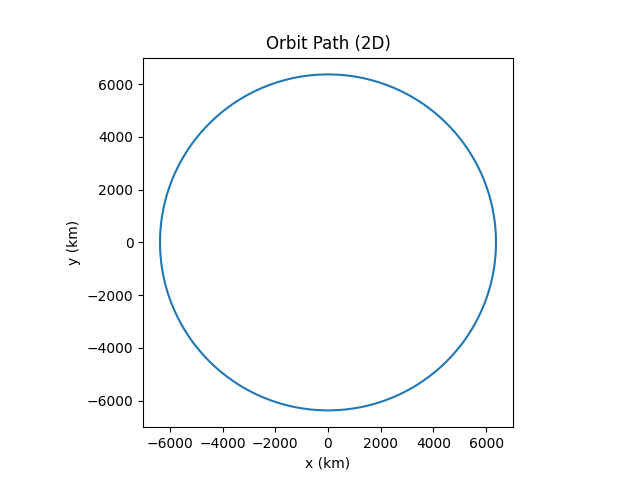
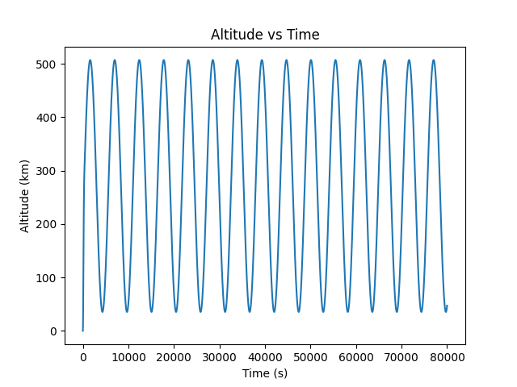

# Orbital Launch & Circularization Simulator

## Overview
This project simulates how a rocket launches from Earth and achieves a stable low Earth orbit using Newtonian physics and numerical integration.

## Motivation
Small errors in velocity or direction can determine whether a spacecraft crashes, escapes, or remains in orbit. This project models that process from first principles.

## Key Challenges
- Numerical instability during long simulations
- Continuous thrust causing non-physical speeds
- Identifying apoapsis for circularization
- Preventing energy drift

## What I Implemented
- Newtonian gravity (inverse-square law)
- Thrust-based propulsion with changing mass
- Gravity turn during ascent
- Apoapsis detection
- Circularization burn
- Runge–Kutta 4 (RK4) integration
- 2D orbit visualization

## Validation
- Stable orbital speed near ~7.7 km/s
- Closed orbit path without decay or escape
- Bounded altitude over long runs

## Results

